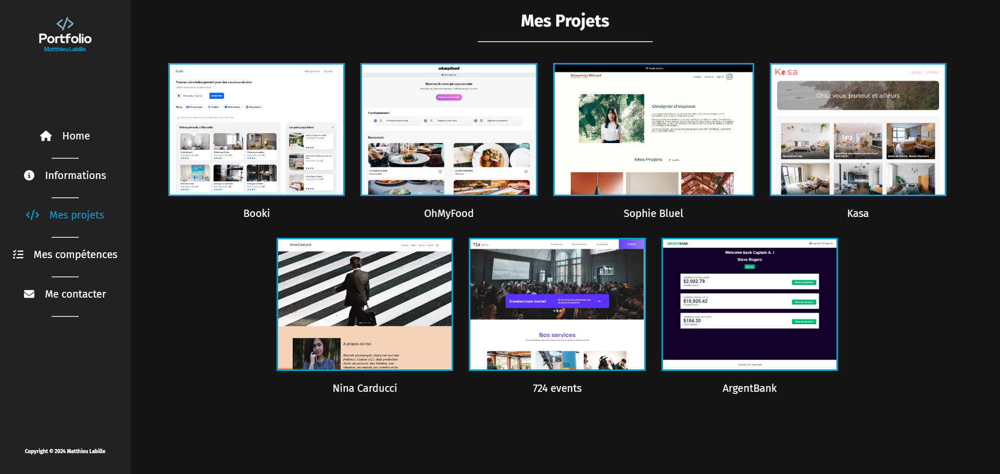
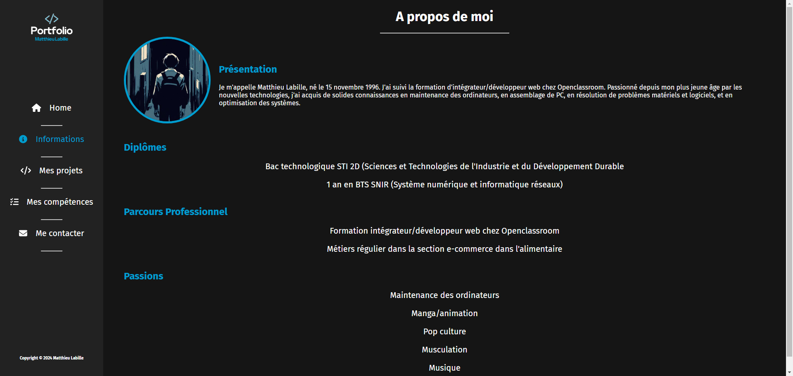

# Matthieu Labille - Portfolio

Bienvenue sur le portfolio de Matthieu Labille, Intégrateur/Développeur Web. Ce site présente mes projets, compétences, et permet de me contacter. Il est conçu pour offrir une vue d'ensemble de mes compétences en développement web front-end et back-end.

## Aperçu

## Fonctionnalités

- **Accueil** : Introduction avec une animation attrayante et des liens vers mes réseaux sociaux.
- **Projets** : Présentation des projets réalisés, avec une modale détaillant chaque projet.
- **Compétences** : Liste des compétences en front-end, back-end et outils/logiciels avec des icônes et animations.
- **Contact** : Formulaire de contact moderne et responsive pour me contacter directement.

## Technologies Utilisées

- **React** : Bibliothèque JavaScript pour construire l'interface utilisateur.
- **CSS** : Feuilles de style pour la mise en page et les animations.
- **FontAwesome** : Icônes pour les réseaux sociaux et les compétences.
- **JSON** : Pour stocker et gérer les données des projets.